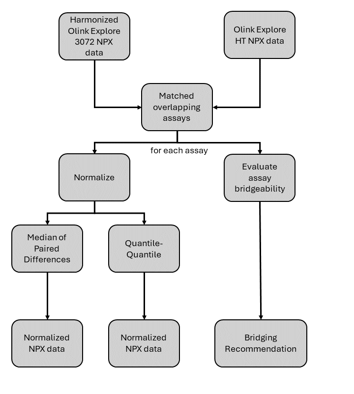

```{r, include = FALSE}
knitr::opts_chunk$set(
  collapse = TRUE,
  comment = "#>",
  tidy = FALSE,
  tidy.opts = list(width.cutoff = 95),
  fig.width = 6,
  fig.height = 3,
  message = FALSE,
  warning = FALSE,
  time_it = TRUE,
  fig.align = "center"
)
```

```{r, echo=FALSE}
library(OlinkAnalyze)
library(dplyr)
library(stringr)
library(ggplot2)
library(kableExtra)
```

## Introduction

## Bridge Sample Selection


## Workflow Overview

Olink Explore 3072 to Olink Explore HT bridging required harmonized Explore 3072 data and Explore HT data which has at least XX overlapping bridge samples. The assays from Explore 3072 are matched to the corresponding assays in Explore HT and evaluated to determine if the assay is bridgeable. In parallel the assay is normalized using quantile-quantile normalization and normalization using the median of paired differences. The result is an adjusted Explore 3072 dataset with three additional columns: a flag which indicates if the assay is bridgeable and, if so, which normalization method performs better, and the NPX values from each of the normalization methods. 

A visual representation of the workflow is shown below.



Note that regardless of the bridging recommendation, NPX values will be available for both normalization methods. 

## Import NPX files

To normalize Explore 3072 data to Explore HT data, first the two datasets are read into R using `read_NPX()`. If more that two datasets are being normalized, all Explore 3072 studies should be normalized together prior to normalizing between products. One Explore HT study should be chosen as the reference dataset. The bridge samples should have the same Sample IDs in both platforms. The input datasets are standard Olink^®^ NPX^TM^ tables. They can be loaded using `read_NPX()` function with default Olink Software NPX file as input, as shown below.

```{r message=FALSE, eval=FALSE, echo = TRUE}
data_E3072 <- read_NPX("~/NPX_Explore3072_location.parquet") # Could also be a CSV file
data_EHT <- read_NPX("~/NPX_ExploreHT_location.parquet")
```

## Checking input datasets and bridging samples

## Normalization

### Determining bridging recommendations
There are four criteria that are used to determine if an assay is bridgable and what normalization method should be used:

* Is there a linear relationship between products? WORDS
* Are the NPX ranges in the two products similar? WORDS
* Are the distributions between products the same shape? WORDS
* Are there sufficient counts in both products? WORDS

If all of these criteria are met then the assay is considered bridgable. Note that bridgable assays will differ between projects based on the expression of bridge samples in the studies.


### Normalization using the median of paired differences

### Quantile-Quantile Normalization

### Function Output

## Evaluating the quality of bridging

## Exporting Normalized Data
The normalized Explore 3072 data can be exported using `arrow::write_parquet()` to create a long format Olink Explore file.

```{r, eval=FALSE}
df <- normalized_data |>
    dplyr::filter(Project == "Explore_3072_NAME") |>
    arrow::as_arrow_table()

df$metadata$FileVersion <- "NA"
df$metadata$ExploreVersion <- "NA"
df$metadata$ProjectName <- "NA"
df$metadata$SampleMatrix <- "NA"
df$metadata$DataFileType <- "Olink Analyze Export File"
df$metadata$ProductType <- "Explore3072"
df$metadata$Product <- "Explore3072"
arrow::write_parquet(x = df, sink = "path_to_output.parquet")
```


## FAQs

### Correlation Assays

### Downstream Analysis


## Contact Us

We are always happy to help. Email us with any questions:

-   biostat\@olink.com for statistical services and general stats
    questions

-   support\@olink.com for Olink lab product and technical support

-   info\@olink.com for more information

## Legal Disclaimer

© 2024 Olink Proteomics AB.

Olink products and services are For Research Use Only and not for Use in
Diagnostic Procedures.

All information in this document is subject to change without notice.
This document is not intended to convey any warranties, representations
and/or recommendations of any kind, unless such warranties,
representations and/or recommendations are explicitly stated.

Olink assumes no liability arising from a prospective reader’s actions
based on this document.

OLINK, NPX, PEA, PROXIMITY EXTENSION, INSIGHT and the Olink logotype are
trademarks registered, or pending registration, by Olink Proteomics AB.
All third-party trademarks are the property of their respective owners.

Olink products and assay methods are covered by several patents and
patent applications <https://olink.com/legal/patents>.

