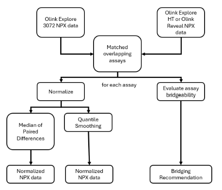

```{r, include = FALSE}
knitr::opts_chunk$set(
  collapse = TRUE,
  comment = "#>",
  tidy = FALSE,
  tidy.opts = list(width.cutoff = 95),
  fig.width = 6,
  fig.height = 3,
  message = FALSE,
  warning = FALSE,
  time_it = TRUE,
  fig.align = "center"
)
```

```{r, echo=FALSE}
library(OlinkAnalyze)
library(dplyr)
library(stringr)
library(ggplot2)
library(kableExtra)
```

## Introduction

## Bridge Sample Selection

## Workflow Overview

Olink Explore 3072 to Olink Explore HT bridging required harmonized
Explore 3072 data and Explore HT data which has at least XX overlapping
bridge samples. The assays from Explore 3072 are matched to the
corresponding assays in Explore HT and evaluated to determine if the
assay is bridgeable. In parallel the assay is normalized using
quantile-quantile normalization and normalization using the median of
paired differences. The result is an adjusted Explore 3072 dataset with
three additional columns:

-   a flag which indicates if the assay is bridgeable and, if so, which
    normalization method performs better

-   NPX values for normalization using the median of paired differences

-   NPX values using quantile-quantile normalization

A visual representation of the workflow is shown below.

```{r, fig.cap= fcap, echo = FALSE, out.width="100%"}

fcap <- "Schematic of Explore 3072 to Explore HT Bridging Workflow"
```


Note that regardless of the bridging recommendation, NPX values will be
available for both normalization methods.

## Import NPX files

To normalize Explore 3072 data to Explore HT data, first the two
datasets are read into R using `read_NPX()`. If more that two datasets
are being normalized, all Explore 3072 studies should be normalized
together prior to normalizing between products. One Explore HT study
should be chosen as the reference dataset. The bridge samples should
have the same Sample IDs in both platforms. The input datasets are
standard Olink^®^ NPX^TM^ tables. They can be loaded using `read_NPX()`
function with default Olink Software NPX file as input, as shown below.

```{r message=FALSE, eval=FALSE, echo = TRUE}
data_E3072 <- read_NPX("~/NPX_Explore3072_location.parquet") # Could also be a CSV file
data_EHT <- read_NPX("~/NPX_ExploreHT_location.parquet")
```

## Checking input datasets and bridging samples

## Normalization

### Determining bridging recommendations

There are four criteria that are used to determine if an assay is
bridgeable and what normalization method should be used:

-   Is there a linear relationship between products?
-   Are the NPX ranges in the two products similar?
-   Are there sufficient counts in both products?
-   Are the distributions between products the same shape?

An overview of these criteria is visualized below.
```{r, fig.cap= fcap, echo = FALSE, out.width="100%"}
knitr::include_graphics("../man/figures/assay_bridgeability.png")
fcap <- "Criteria to determine the bridging recommendation for an assay"
```


Prior to assessment, outlier bridge samples are excluded. A sample is considered an outlier if the NPX value is more than 3 times the interquartile range above or below the median on either platform. 

After assessment, an assay is considered bridgeable if it meets the first three criteria. The fourth criteria determines which normalization method is recommended for bridging. If all four criteria are met than the recommended method is normalization using the median of paired differences. If only the first three criteria are met then quantile-quantile normalization is recommended. If any of the first three criteria are not met than bridging is not recommended for that assay. Note that bridgeable assays
will differ between projects based on the expression of bridge samples
in the studies.

#### Assessing linearity across products

To determine if there is a linear relationship between products for an assay, the linear coefficient of determination is calculated using Pearson correlation. In this correlation counts below 10 are excluded due to lack of signal. The R^2 value is calculated and an assay is considered to have a linear relationship across products if the R^2 value is above the cutoff. The default cutoff is set to R^2 > 0.8.

#### Assessing similarity of NPX ranges

To determine if the NPX ranges are similar across products, the difference in NPX values from the 10% to 90% quantile is calculated for each platform, excluding data points with counts less than 10. If the difference in range between platforms is greater than the cutoff than the ranges are not considered similar across platforms. By default, the cutoff is a difference of less than 1 NPX between platforms.

#### Assessing if there are sufficient counts.

To determine if there are sufficient counts in an assay for bridging, the median number of counts ***platform*** is calculated, excluding counts less than 10. If the median number of counts is less than the cutoff than the assay does not have sufficient counts to be used for bridging. The default cutoff is a median of greater than 150 counts.

#### Assessing similarity of NPX distribution across products

If the three criteria outlined above are met than the assay is considered bridgeable. Otherwise, bridging is not recommended for that assay. If an assay is bridgeable the similarity of the NPX distribution is used to determine which method is recommended for bridging. The Kolmogorov-Smirnov test, or KS test, is used to assess the similarity of two distributions by calculating the distances between the NPX distributions for each product. If the distance is above the cutoff than quantile-quantile normalization is recommended. If the distance is less than the cutoff than normalization using the median of paired differences is recommended. By default this cutoff difference is set to 0.2.

### Normalization using the median of paired differences

### Quantile-Quantile Normalization

### Function Output

## Evaluating the quality of bridging

## Exporting Normalized Data

The normalized Explore 3072 data can be exported using
`arrow::write_parquet()` to create a long format Olink Explore file.

```{r, eval=FALSE}
df <- normalized_data |>
    dplyr::filter(Project == "Explore_3072_NAME") |>
    arrow::as_arrow_table()

df$metadata$FileVersion <- "NA"
df$metadata$ExploreVersion <- "NA"
df$metadata$ProjectName <- "NA"
df$metadata$SampleMatrix <- "NA"
df$metadata$DataFileType <- "Olink Analyze Export File"
df$metadata$ProductType <- "Explore3072"
df$metadata$Product <- "Explore3072"
arrow::write_parquet(x = df, sink = "path_to_output.parquet")
```

## FAQs

### Correlation Assays

### Downstream Analysis

## Contact Us

We are always happy to help. Email us with any questions:

-   biostat\@olink.com for statistical services and general stats
    questions

-   support\@olink.com for Olink lab product and technical support

-   info\@olink.com for more information

## Legal Disclaimer

© 2024 Olink Proteomics AB.

Olink products and services are For Research Use Only and not for Use in
Diagnostic Procedures.

All information in this document is subject to change without notice.
This document is not intended to convey any warranties, representations
and/or recommendations of any kind, unless such warranties,
representations and/or recommendations are explicitly stated.

Olink assumes no liability arising from a prospective reader’s actions
based on this document.

OLINK, NPX, PEA, PROXIMITY EXTENSION, INSIGHT and the Olink logotype are
trademarks registered, or pending registration, by Olink Proteomics AB.
All third-party trademarks are the property of their respective owners.

Olink products and assay methods are covered by several patents and
patent applications <https://olink.com/legal/patents>.
