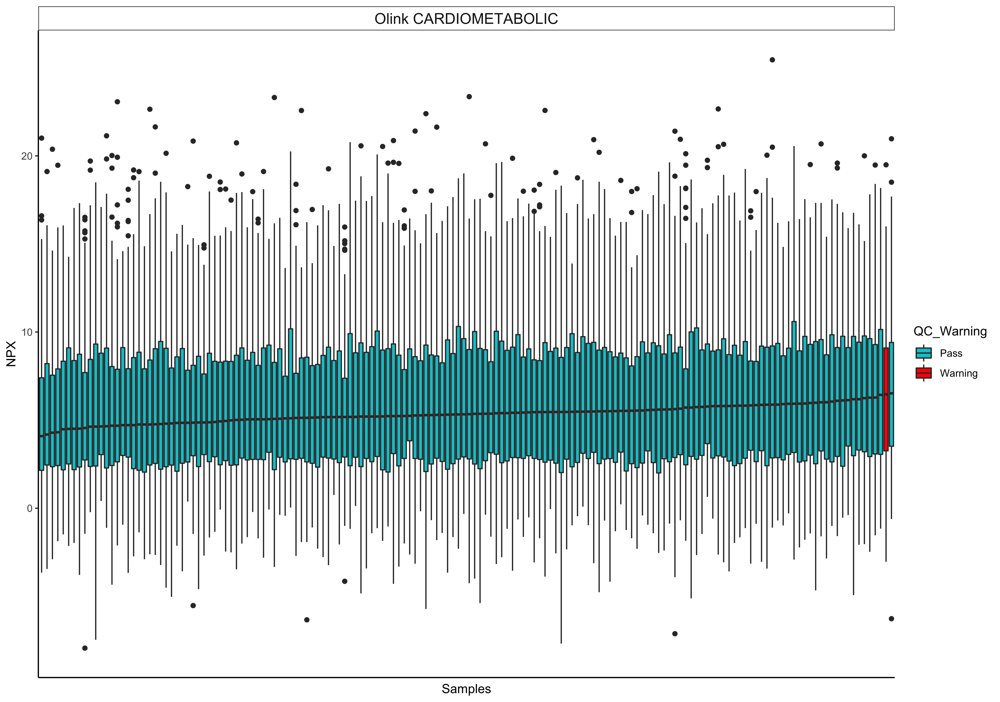
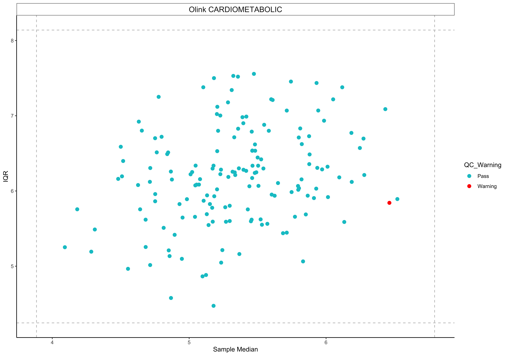

<!-- README.md is generated from README.Rmd. Please edit that file -->

# OlinkAnalyze 

The goal of OlinkAnalyze is to provide a versatile toolbox to enable
easy and smooth handling of Olink NPX data to speed up your proteomic
research. OlinkAnalyze provides functions ranging from reading Olink NPX
data as exported by NPX Manager to various statistical tests and
modelling, via different QC plot functions. Thereby providing a
convenient pipeline for your Olink NPX data analysis.

## Installation

``` r
# install.packages("devtools")
devtools::install_github(repo ='Olink-Proteomics/OlinkRPackage/OlinkAnalyze')
```

## Usage

### Reading Olink NPX data

``` r
# open package
library(OlinkAnalyze)

# reading Olink NPX data 
my_NPX_data <- read_NPX(filename = "path/to/my_NPX_data.xlsx")
```

### QC plot functions

There are several plot functions, below follows two examples using the
package provided npx\_data1
dataset:

``` r
# visualize the NPX distribution per sample per panel, example for one panel
olink_dist_plot(npx_data1 %>% filter(Panel == 'Olink CARDIOMETABOLIC')) +
  theme(axis.text.x = element_blank(),
        axis.ticks.x = element_blank()) +
  scale_fill_manual(values = c('turquoise3', 'red'))
```



``` r
# visualize potential outliers by IQR vs. sample median per panel, example for one panel
olink_qc_plot(npx_data1 %>% filter(Panel == 'Olink CARDIOMETABOLIC')) +
  scale_color_manual(values = c('turquoise3', 'red'))
```



### Normalization

OlinkAnalyze provides several means of normalization when analyzing
multiple datasets. Below follows an example of reference sample (aka
bridge) normalization using the two package provided npx\_data1 and
npx\_data2 datasets:

``` r
# identify bridge samples
bridge_samples <- intersect(x = npx_data1$SampleID,
               y = npx_data2$SampleID)

# bridge normalize
bridge_normalized_data <- olink_normalization(df1 = npx_data1,
                        df2 = npx_data2,
                        overlapping_samples_df1 = bridge_samples,
                        df1_project_nr = "20200001",
                        df2_project_nr = "20200002",
                        reference_project = "20200001")
```

### Statistical tests and models

OlinkAnalyze provides several statistical tests and model tools. Below
follows an example of how to perform a t-test and how to visualize the
t-test output in a volcano plot using the package provided npx\_data1
dataset:

``` r
# t-test npx_data1
ttest_results_NPX1 <- olink_ttest(df = npx_data1,
                variable = "Treatment")

# select names of the top #10 most significant proteins
ttest_sign_NPX1 <- ttest_results_NPX1 %>%
    head(n=10) %>%
    pull(OlinkID)

# volcano plot with annotated top #10 most significant proteins
olink_volcano_plot(p.val_tbl = ttest_results_NPX1,
                olinkid_list = ttest_sign_NPX1) +
  scale_color_manual(values = c('turquoise3', 'red'))
```


## Learn more

Please see the function specific help pages. Moreover, OlinkAnalyze
includes two simulated NPX datasets for your convenience to help you
explore the package and its functions.

## Issues

Please report any issues (good or bad) to
\<biostattools\[a\]olink.com\>.

## Credits

OlinkAnalyze is developed and maintained by the Olink Proteomics Data
Science Team.
